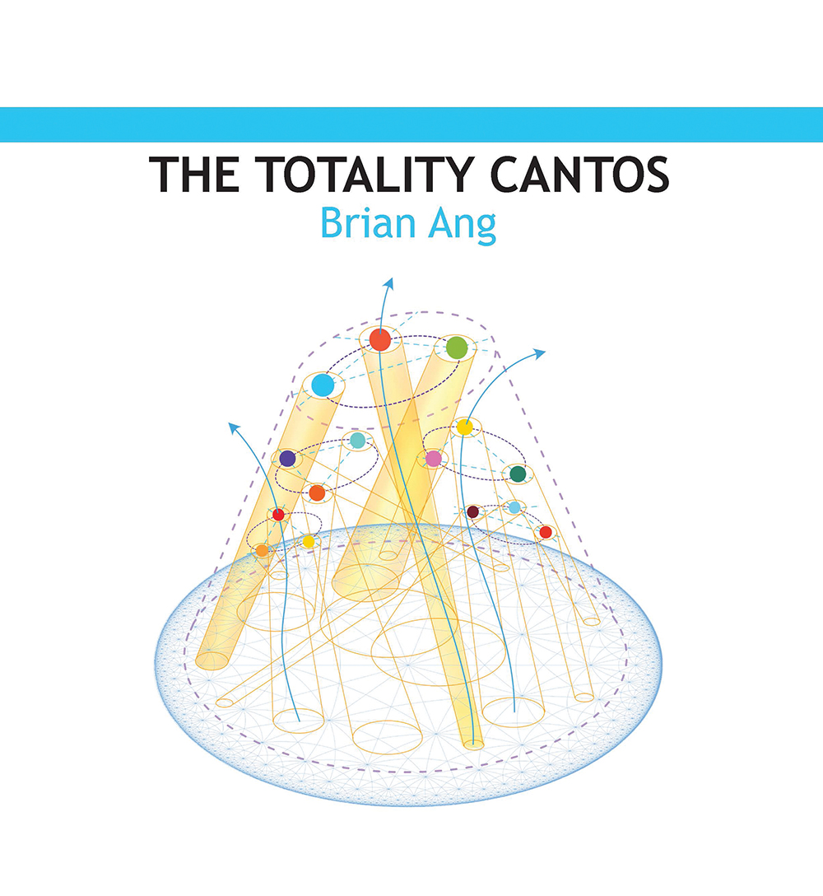

<br/>
<p align="center">
  <a href="https://totalitycantos.net/">
    
  </a>


  <p align="center">
    The Totality Cantos generator
    <br/>
    <br/>
    <a href="https://github.com/ShaanCoding/ReadME-Generator"><strong>Explore the docs »</strong></a>
    <br/>
    <br/>
    <a href="https://totalitycantos-sendsent.vercel.app/">View Demo</a>
  
  </p>
</p>
<!-- 
     -->

## Table Of Contents

- [Table Of Contents](#table-of-contents)
- [About The Project](#about-the-project)
- [Built With](#built-with)
- [License](#license)
- [Authors](#authors)

## About The Project


The 2008 economic crisis and global backdrop of struggles by 2011 renewed possibilities for thinking totality, materializing it for apprehension. Brian Ang wrote The Totality Cantos out of a desire to be interested in everything, sampling from discourses of history, philosophy, religion, science, and the humanities, all offering knowledges of what constitute totality. This major work is constructed along the principles of assemblage poetics, and exemplifies constructive verse: writing adequate to apprehending totality.

The Totality Cantos generator randomizes assemblages of the poem’s one thousand sections. 
## Built With

React
Immer

<!-- ## Getting Started

This is an example of how you may give instructions on setting up your project locally.
To get a local copy up and running follow these simple example steps.

### Prerequisites

This is an example of how to list things you need to use the software and how to install them.

* npm

```sh
npm install npm@latest -g
```

### Installation

1. Get a free API Key at [https://example.com](https://example.com)

2. Clone the repo

```sh
git clone https://github.com/your_username_/Project-Name.git
```

3. Install NPM packages

```sh
npm install
```


```

## Usage

Use this space to show useful examples of how a project can be used. Additional screenshots, code examples and demos work well in this space. You may also link to more resources.

_For more examples, please refer to the [Documentation](https://example.com)_

## Roadmap

See the [open issues](https://github.com/ShaanCoding/ReadME-Generator/issues) for a list of proposed features (and known issues).

## Contributing

Contributions are what make the open source community such an amazing place to be learn, inspire, and create. Any contributions you make are **greatly appreciated**.
* If you have suggestions for adding or removing projects, feel free to [open an issue](https://github.com/ShaanCoding/ReadME-Generator/issues/new) to discuss it, or directly create a pull request after you edit the *README.md* file with necessary changes.
* Please make sure you check your spelling and grammar.
* Create individual PR for each suggestion.
* Please also read through the [Code Of Conduct](https://github.com/ShaanCoding/ReadME-Generator/blob/main/CODE_OF_CONDUCT.md) before posting your first idea as well.

### Creating A Pull Request

1. Fork the Project
2. Create your Feature Branch (`git checkout -b feature/AmazingFeature`)
3. Commit your Changes (`git commit -m 'Add some AmazingFeature'`)
4. Push to the Branch (`git push origin feature/AmazingFeature`)
5. Open a Pull Request -->

## License

Distributed under the MIT License. See [LICENSE](https://github.com/ShaanCoding/ReadME-Generator/blob/main/LICENSE.md) for more information.

## Authors

* [Alif Sajan](https://github.com/sendsent/)
* [Franz Fernando](https://github.com/FJF616)


<!-- # Totality of Cantos Generator V 2.0
###React version of the random cantos generator project written in plain JS with P5js for Brian Ang 

###randomly generate and display an arbitrary number of canto sections. 

###each section must fit the following constraints:  
-for each pair of cantos
  -the canto positioned on top must not contain the same number of words or margin spaces in its last line of text as the first line of text in the section that proceeds after it. -->


<!-- ###Issues Fixed:
-application freezes when large number of cantos is being generated
-clashes with canto position/not fitting wordcount and margincount constraints
- -->